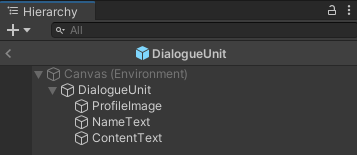

# 구현에 관한 제안

작성하신 기획서에 따르면 Rug Pull에는 다양한 미니게임이 독립적으로 존재합니다. 각 미니게임별로 어떻게 개발하면 좋을지 의견을 남겨보려고 하니 참고해주시면 될 것 같아요. 아래 내용에 대한 구현도 지금 이 리포지토리에 만들어 두었어요. zip 파일로 내려받아 압축을 푼 후 유니티로 열어 확인해보시면 됩니다.

## Coin Design

게임 내 구현 중 꽤 어려운 축에 속할 것이라고 생각이 되는 부분입니다. 캔버스에 해당하는 오브젝트에 사용자가 마우스로 그림을 그리면 텍스쳐가 변하는데요. 이 때, 마우스가 가리키는 위치를 찾기 위해 레이캐스트 기능이 이용됩니다. [인터넷에 찾아보니 적합한 튜토리얼 글을 찾았어요.](https://unity3d.college/2017/07/22/build-unity-multiplayer-drawing-game-using-unet-unity3d/)

위 튜토리얼은 온라인을 가정하고 진행하기 때문에, ***Error! – An Extension Method!*** 이후 부터는 읽지 않아도 돼요. 위에서 알려주는 내용을 참고하시되, **PlayerBrush.cs** 내용은 다음으로 대치해 주세요. 튜토리얼의 해당 코드는 온라인을 가정하기 때문에 작동하지 않아요.

```csharp
using System.Collections;
using System.Collections.Generic;
using UnityEngine;
using UnityEngine.Networking;

public class PlayerBrush : MonoBehaviour
{

    private void Update()
    {
        if (Input.GetMouseButton(0))
        {
            Ray ray = Camera.main.ScreenPointToRay(Input.mousePosition);

            RaycastHit hit;
            if (Physics.Raycast(ray, out hit))
            {
                var pallet = hit.collider.GetComponent<PaintCanvas>();
                if (pallet != null)
                {
                    Debug.Log(hit.textureCoord);
                    Debug.Log(hit.point);

                    Renderer rend = hit.transform.GetComponent<Renderer>();
                    MeshCollider meshCollider = hit.collider as MeshCollider;

                    if (rend == null || rend.sharedMaterial == null || rend.sharedMaterial.mainTexture == null || meshCollider == null)
                        return;

                    Texture2D tex = rend.material.mainTexture as Texture2D;
                    Vector2 pixelUV = hit.textureCoord;
                    pixelUV.x *= tex.width;
                    pixelUV.y *= tex.height;

                    BrushAreaWithColor(pixelUV, ColorPicker.SelectedColor, BrushSizeSlider.BrushSize);
                }
            }
        }
    }

    private void BrushAreaWithColor(Vector2 pixelUV, Color color, int size)
    {
        for (int x = -size; x < size; x++)
        {
            for (int y = -size; y < size; y++)
            {
                if ((int)pixelUV.x + x < 0 || (int)pixelUV.y + y < 0) continue;
                PaintCanvas.Texture.SetPixel((int)pixelUV.x + x, (int)pixelUV.y + y, color);
            }
        }

        PaintCanvas.Texture.Apply();
    }
}
```

또, 주의해야 될 부분들이 좀 있어요. Color Wheel,  Selected Color, White With Border 등 그림판 구현을 위해 사용되는 이미지 파일들은 유니티에 추가한 뒤, **Inspector** 메뉴에서 **Read/Write Enable** 옵션을 켜주셔야 합니다.


또, 그림을 그리면서 실제로 데이터가 수정되는 캔버스의 이미지는 ***Format***을 정해주셔야 합니다. 어떤 포맷이든 상관없지만 저는 ***RGB 16bit***로 설정했습니다.


위 설정을 모두 마쳤으면 ***Apply*** 버튼을 눌러 변경사항을 적용해주세요. 문제 없이 잘 따라온다면 다음과 같이 그림판이 완성돼요.


사용자가 그림을 그리면서 변화된 텍스쳐 데이터는 ***PaintCanvas*** 클래스의 ***Texture*** 멤버 변수에 저장돼요. 해당 멤버 변수는 static으로 선언돼 있기 때문에 씬을 전환하더라도 `PaintCanvas.Texture`를 통해 접근할 수 있어요. 만약, 다른 씬의 오브젝트에 사용자가 그린 텍스쳐를 적용하려면 다음 코드를 활용하면 돼요.

```csharp
GetComponent<Renderer>().material.mainTexture = PaintCanvas.Texture;
```

## DM with Influencer

정말 많은 분기가 발생될 것이라 예상되는 미니게임 입니다. 하지만 난이도 자체는 어렵지 않을 것 같아요. 이 부분에서 구현할 기능은 다음 세 가지 정도로 보여요.

- DM을 보낼 인플루언서를 선택
- 인플루언서에게 보낼 메시지를 선택
- 선택에 따라 적절한 답장 출력

위처럼 게임 내에서 대화에 선택지가 있어 분기점이 나뉘어지는 것을 **대화 트리**라고 불러요. 대화의 각 단계마다 선택지가 있고, 그 선택지에 따라 대화의 흐름이 달라지게 돼요. 이를 쉽게 구현하기 위해 우선 아래처럼 UI를 구성해보면 좋을 것 같아요.


각 버튼은 대화 단계별 선택지의 내용이 들어가고, 그에따라 대화 내용이 위의 스크롤 레이아웃에 하나씩 추가되는 방식이에요. 해당 씬에 **Empty Object**를 하나 생성해서 대화 진행을 위한 코드를 적용시켰어요. 해당 코드는 아래와 같아요.
    
```csharp
using System.Collections;
using System.Collections.Generic;
using UnityEngine;
using UnityEngine.UI;
using UnityEngine.EventSystems;

public class MessagingManager : MonoBehaviour
{
    public EventSystem eventSystem;        // 각 대화 단계에서 선택한 버튼을 식별할 때 사용합니다.
    public ScrollRect scrollView;          // 대화가 출력될 때 스크롤을 아래로 내려주기 위해 사용됩니다.
    public GameObject DialogueUnit;        // 대화의 한 단위를 나타내는 프리팹입니다. 프로필, 이름, 내용으로 구성돼 있습니다.
    public RectTransform ContentView;      // 대화가 여기에 생성됩니다.
    public Button OP01, OP02, OP03;        // 대화의 각 단계별 선택지를 제공하는 버튼들입니다.
    public Text NotificationBar;           // 대화가 종료되었을 때, 이를 알리는 텍스트입니다.
    public Button EndButton;               // 대화가 종료된 이후에 게임을 종료하기 위한 버튼입니다.

    // 대화의 각 단계별 분기점에서 선택에 따라 아래 값이 다르게 바뀝니다.
    private int step;

    // 대화가 생성된 이후 스크롤을 아래로 내리는 함수입니다.
    // 아래와 같은 함수를 코루틴이라고 부르며 자세한 내용은 다음을 참고해주세요.
    // https://youtu.be/ahji9F5hJJ4
    IEnumerator ForceScrollDown()
    {
        yield return new WaitForEndOfFrame();
        scrollView.verticalNormalizedPosition = 0f;
    }

    // 대화의 한 단위를 출력하는 함수입니다.
    // Instantiate 함수를 이용해서 ContentView의 자식으로 생성합니다.
    // 이후 스크롤을 아래로 내려주기 위한 함수를 호출합니다.
    void printDialogueUnit(string speaker, string msg)
    {
        GameObject dialogueUnit = Instantiate(DialogueUnit, ContentView);
        dialogueUnit.transform.GetChild(2).GetComponent<Text>().text = msg;
        StartCoroutine(ForceScrollDown());
    }

    // 대화의 각 단계별 선택지를 지정해주는 함수입니다.
    void setOptions(string optionOne, string optionTwo, string optionThree)
    {
        OP01.GetComponentInChildren<Text>().text = optionOne;
        OP02.GetComponentInChildren<Text>().text = optionTwo;
        OP03.GetComponentInChildren<Text>().text = optionThree;
    }

    // 대화가 출력되는 동안 혹은 대화가 종료된 이후 버튼을 비활성화 합니다.
    void disableOptions()
    {
        setOptions("", "", "");
        OP01.gameObject.SetActive(false);
        OP02.gameObject.SetActive(false);
        OP03.gameObject.SetActive(false);
    }

    // 대화가 모두 출력된 이후 비활성화 했던 버튼을 다시 활성화 합니다.
    void enableOptions()
    {
        OP01.gameObject.SetActive(true);
        OP02.gameObject.SetActive(true);
        OP03.gameObject.SetActive(true);
    }

    // 맨 처음 대사와 선택지를 설정해줍니다.
    void Start()
    {
        printDialogueUnit("상대방", "하고 싶은 말이 뭐에요?");
        setOptions("이름", "집", "회사");
        step = 0;
    }

    // 각 대화 단위는 1초의 간격을 두고 출력합니다.
    // 그러기 위해 아래 함수는 코루틴으로 정의돼 있습니다.
    IEnumerator printDialogue()
    {
        // 선택지 버튼을 비활성화 한 이후, 어떤 버튼이 클릭됐는지 찾습니다.
        disableOptions();
        Button clickedButton = eventSystem.currentSelectedGameObject.GetComponent<Button>();

        // 현재 분기점이 어디냐에 따라 출력되는 메시지와 선택지가 달라집니다.
        // 선택지에 따라 분기점(step의 값)을 잘 설정해주어 대화의 흐름을 형성해주면 됩니다.
        switch (step)
        {
            case 0:
                // 각 분기점에서는 이전 단계에서 선택된 옵션에 따라 다르게 동작합니다.
                // 원하는 경우 OR 연산자(||)를 통해 같은 동작을 의도할 수도 있습니다.
                if (Button.ReferenceEquals(clickedButton, OP01))
                {
                    // 메시지를 출력한 이후 1초를 기다립니다.
                    printDialogueUnit("당신", "이름이 뭐에요?");
                    yield return new WaitForSeconds(1);
                    printDialogueUnit("상대방", "제 이름은 ㅇㅇㅇ에요.");
                    yield return new WaitForSeconds(1);
                    // 선택지를 설정해준 후 다음 분기점을 지정해줍니다.
                    setOptions("커피", "점심", "저녁");
                    step = 1;
                }
                else if (Button.ReferenceEquals(clickedButton, OP02))
                {
                    printDialogueUnit("당신", "집이 어디에요?");
                    yield return new WaitForSeconds(1);
                    printDialogueUnit("상대방", "제 집은 이 근처에요.");
                    yield return new WaitForSeconds(1);
                    setOptions("커피", "점심", "저녁");
                    step = 1;
                }
                else if (Button.ReferenceEquals(clickedButton, OP03))
                {
                    printDialogueUnit("당신", "회사가 어디에요?");
                    yield return new WaitForSeconds(1);
                    printDialogueUnit("상대방", "제 회사는 이 근처에요.");
                    yield return new WaitForSeconds(1);
                    setOptions("이직", "퇴사", "퇴근");
                    step = 2;
                }
                break;
            case 1:
                if (Button.ReferenceEquals(clickedButton, OP01))
                {
                    printDialogueUnit("당신", "커피 드실래요?");
                    yield return new WaitForSeconds(1);
                    printDialogueUnit("상대방", "아니요.");
                }
                else if (Button.ReferenceEquals(clickedButton, OP02))
                {
                    printDialogueUnit("당신", "점심 드실래요?");
                    yield return new WaitForSeconds(1);
                    printDialogueUnit("상대방", "아니요.");
                }
                else if (Button.ReferenceEquals(clickedButton, OP03))
                {
                    printDialogueUnit("당신", "저녁 드실래요?");
                    yield return new WaitForSeconds(1);
                    printDialogueUnit("상대방", "아니요.");
                }
                // 더 이상 이어지는 대화가 없다면 step의 값이 -1을 저장하여 대화가 종료되었음을 나타냅니다.
                step = -1;
                break;
            case 2:
                if (Button.ReferenceEquals(clickedButton, OP01))
                {
                    printDialogueUnit("당신", "이직 하실래요?");
                    yield return new WaitForSeconds(1);
                    printDialogueUnit("상대방", "아니요.");
                }
                else if (Button.ReferenceEquals(clickedButton, OP02))
                {
                    printDialogueUnit("당신", "퇴사 하실래요?");
                    yield return new WaitForSeconds(1);
                    printDialogueUnit("상대방", "아니요.");
                }
                else if (Button.ReferenceEquals(clickedButton, OP03))
                {
                    printDialogueUnit("당신", "퇴근 하실래요?");
                    yield return new WaitForSeconds(1);
                    printDialogueUnit("상대방", "네.");
                }
                step = -1;
                break;
        }
        // 대화가 출력된 이후에는 버튼을 다시 활성화합니다.
        enableOptions();

        // 대화가 종료된 경우입니다.
        // 선택지 버튼을 비활성화 한 뒤, 대화 종료 알림을 출력합니다.
        // 게임을 종료하는 버튼을 활성화시켜 게임을 종료할 수 있겠끔합니다.
        if (step == -1)
        {
            disableOptions();
            yield return new WaitForSeconds(1);
            Text notificationBar = Instantiate(NotificationBar, ContentView);
            notificationBar.text = "대화가 종료되었습니다.";
            StartCoroutine(ForceScrollDown());
            EndButton.gameObject.SetActive(true);
        }
    }

    // 선택지 버튼을 클릭했을 때, 호출되는 함수입니다. (이러한 함수를 콜백함수라고 합니다)
    // 이러한 함수는 코루틴으로 정의될 수 없기 떄문에 별도로 정의한 코루틴 함수를 호출해줍니다.
    // 코루틴 함수는 StartCoroutine 함수를 통해 호출해야 합니다.
    public void onClick()
    {
        StartCoroutine(printDialogue());
    }

    // 게임 종료 버튼을 누르면 호출되는 함수입니다.
    // 다른 작업 없이 게임을 종료합니다.
    public void exitGame()
    {
        Application.Quit();
    }
}
```
    

아래 이미지는 위 UI에 대한 레이아웃 구성이에요. 대화의 메시지들은 **Content**에 하나씩 추가됩니다.


대화의 각 메시지는 아래 이미지의 프리팹을 복제해서 생성돼요. **ProfileImage**에는 프로필 사진이 **NameText**에는 이름이, **ContentText**에는 메시지 내용이 추가됩니다.


